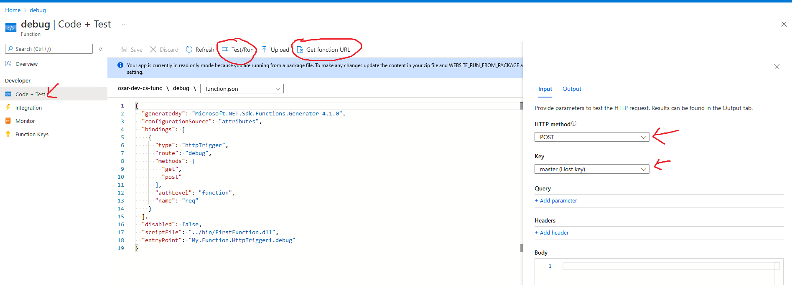

# Azure Function Development Workflow

Function app > Functions > [function name link]

Ive highlighted some notable pieces that are easy to overlook for a newcomer.

This allows you to test things from the web portal.
To use posthman, you can copy the function URL and submit the request from there.

