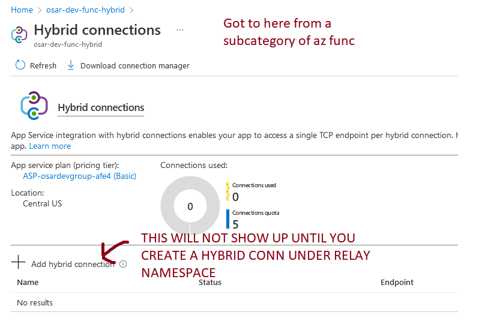
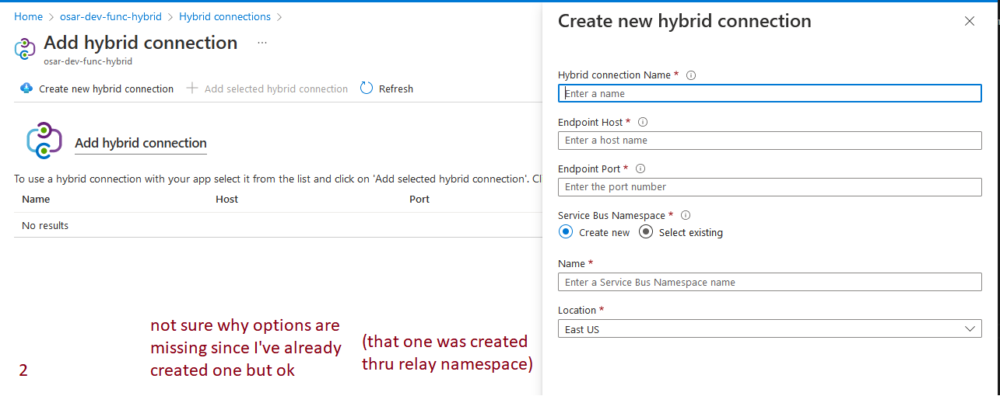

# Azure Hybrid Connections and Relays

This guide is a bit outdated and incomplete (step of hybrid connections). This document will fill in some of the gaps.
https://www.stefanroth.net/2019/01/13/azure-functions-azure-functions-using-hybrid-connections/


Synopsis of guide:
1. Create an az function
- Note: Not available for free Shared or Consumption plans. You have to choose a more expensive option, double check it doesn't say it's one of those two things. The one I found to kind of work was $52/mo.

I noticed an Isolated option for "Advanced networking and scale". Left it alone for now.

https://docs.microsoft.com/en-us/azure/app-service/app-service-hybrid-connections


Notable Menus:
- Relay
  - Search "relay" and create namespace
  - Under "Entities" you can add hybrid connections and WCF relays
- Hybrid connection
  - Requires relay namespace to exist (the menu just says Relay)
  - Can add hybrid connections to resrcs after the first initialization (although seems weird?) See pics for example:

Definitions:
* hybrid connection - websocket
* WCF - RPC, supposedly legacy



Based on the helptext in this screenshot, you need another piece of software called **hybrid connection manager** installed on your internal box.

According to microsoft docs:
"The Hybrid Connections feature requires a relay agent in the network that hosts your Hybrid Connection endpoint. That relay agent is called the Hybrid Connection Manager (HCM). To download HCM, from your app in the Azure portal, select Networking > Configure your Hybrid Connection endpoints."

This option does not exist on the portal so this information is utterly useless. Rather than giving a direct download link like a normal person.


[step] Create listener for hyco
Possible (but useless) resrcs
https://github.com/uglide/azure-content/blob/master/includes/app-service-hybrid-connections-manager-install.md
.net
https://docs.microsoft.com/en-us/azure/azure-relay/relay-hybrid-connections-http-requests-dotnet-get-started

# LOOK AT THIS ^^^^^^^^^^^^^^


=======================

CLI commands, since the UI doesnt want to show me any options or help text
```
az webapp hybrid-connection add
az appservice hybrid-connection set-key
```
https://docs.microsoft.com/en-us/cli/azure/webapp/hybrid-connection?view=azure-cli-latest

App service plan [thing] idk

couldnt find this in guides or antying but using --help variations in the CLI i found a command that should theoretically work

az relay
https://docs.microsoft.com/en-us/cli/azure/relay?view=azure-cli-latest

ohh shit ok so I couldnt figure it out what was meant by `--hybrid-connection` argument but apparently you have to create these from the namespace menu
eg
https://portal.azure.com/#@uillinoisedu.onmicrosoft.com/resource/subscriptions/64ef5477-cc9c-437e-a1c0-56ddae9c1e92/resourceGroups/osar-dev_group/providers/Microsoft.Relay/namespaces/osar-dev-relay-ns/overview

A better resource on relays
https://docs.microsoft.com/en-us/azure/azure-relay/relay-what-is-it