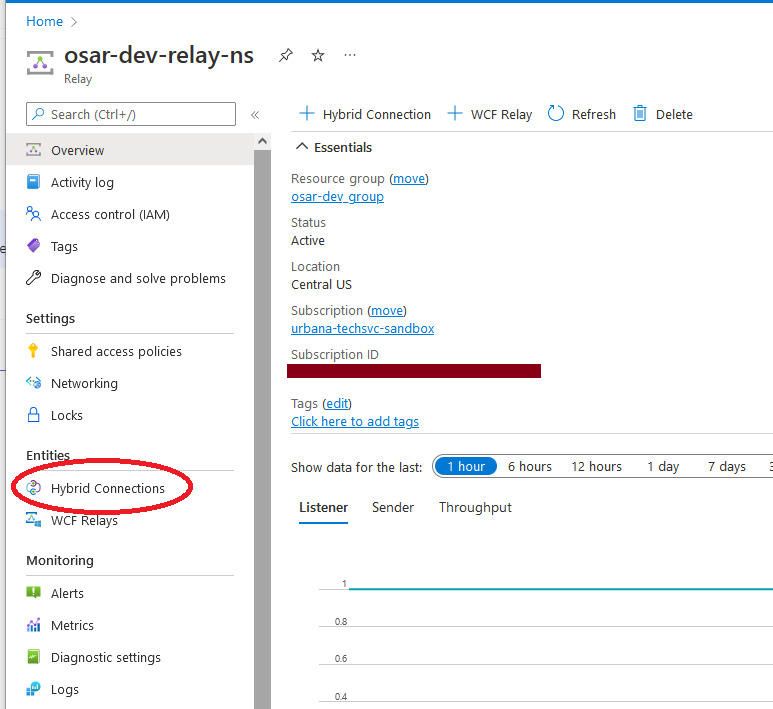
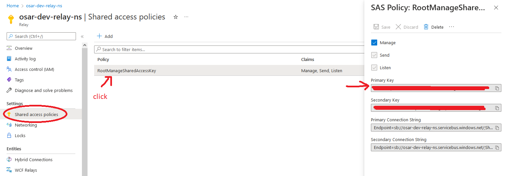
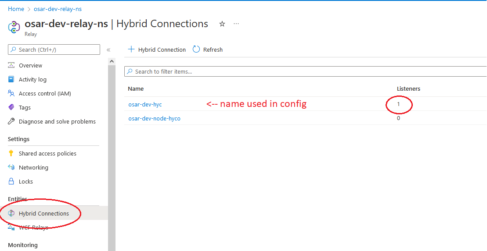

# Azure Relay Setup

## Setup with simple listener

### 1 - Create Relay Namespace
- On azure portal search "Relay" and create namespace

### 2 - Create Hybrid Connection (hyco) from Relay
- From Relay namespace menu, go to Entities > Hybrid Connections

- "+ Hybrid Connection", enter a name

- Note: One connection must be created here to have the ability to create connections from other resources

### 3 - Write basic listener/sender code that uses an MS hyco library
- See end of document for example nodejs code

### 4 - Gather data for local code to connect to hyco
Properties needed (as named by Microsoft devs):
- `ns` - a URL, format of `[relay-namespace-name].servicebus.windows.net` (do not add slashes)
- `path` - The name of the hyco you created
- `keyrule` - The name of the access policy (see below)
- `key` - SAS policy key: The key associated with that access policy

#### Grab SAS policy key (`key` and `keyrule`)
- Relay > Shared access policies
- Click the default RootManageSharedAccessKey. Note this name as the `keyrule`.
- Note the Primary Key field as the `key`


#### Hyco name (`path`)
- Click on Entities > Hybrid Connections to see a list of hyco names

### 5 - Run the local code and perform a test
- Add information from step 4 to the program (see end of document)
- Run listener

PowerShell terminal:
```
PS C:\Projects\node-relay> node .\listener.js
```
- Run sender
```
PS C:\Projects\node-relay> node .\sender.js
```
- Verify listener is connected to hyco
- Relay > Hybrid Connections > Listeners column


### Local NodeJS hyco HTTPS code
#### Listener
```
const https = require('hyco-https')

var args = {
  ns: "osar-dev-relay-ns.servicebus.windows.net",
  path: "osar-dev-hyc",
  keyrule: "RootManageSharedAccessKey",
  key: "<redacted>"
};

var uri = https.createRelayListenUri(args.ns, args.path);
var server = https.createRelayedServer(
  {
    server: uri,
    token: () => https.createRelayToken(uri, args.keyrule, args.key)
  },
  (req, res) => {
    console.log(`[INFO] Received ${req.method} request at ${req.url}`);
    res.setHeader('Content-Type', 'text/html');
    res.end('<html><head><title>Hey!</title></head><body>Relayed Node.js Server!</body></html>');
  });

server.listen((err) => {
  if (err) {
    console.log('Error establishing listener', err.message);
    return;
  }
  console.log(`Server is listening on ${port}`)
});

server.on('error', (err) => {
  console.log('Received err event');
  console.error(err.message);
});
```
#### Sender

## Setup with Azure resource

## 3 - Create resource such as Azure Function